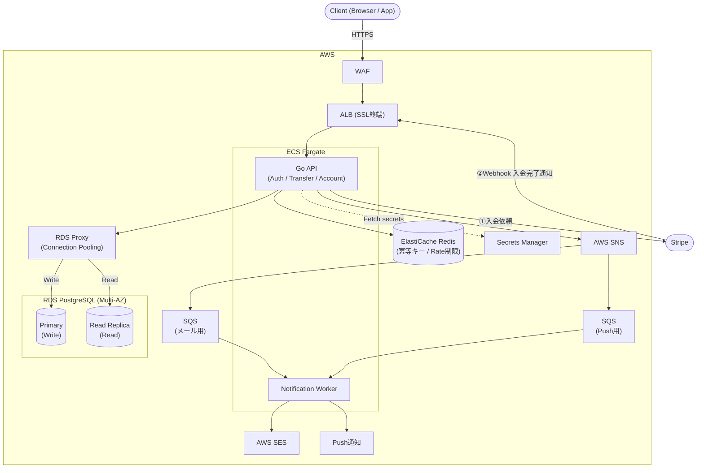

# payral

> 送金・入金・口座管理API

---

## アーキテクチャ図



**入金フロー** — 外の世界からお金を「持ち込む」操作

クレジットカードや銀行口座など、payral の外にある本物のお金を残高に反映させる。外部の決済処理が必要なため Stripe を経由する。

1. Transfer Service `──►` Stripe API（①カード決済を依頼）
2. Stripe `──►` Transfer Service（②決済完了を Webhook で通知 → 口座残高に反映）

**送金フロー** — payral 内でお金を「動かす」操作

すでに payral 内にある残高を別ユーザーへ移すだけ。お金は外に出ないので DB の数字を書き換えるだけで完結し、Stripe は不要。

- 自分の口座 `──►` 相手の口座（RDS のトランザクションのみ・外部サービス呼び出しなし）

---

## 技術スタック

### バックエンド

| カテゴリ          | 技術                | 用途                                 |
| ----------------- | ------------------- | ------------------------------------ |
| 言語              | Go 1.26.4           |                                      |
| APIフレームワーク | ConnectRPC v1.x     | REST + gRPC 両対応（単一実装）       |
| スキーマ定義      | Protocol Buffers    | APIコントラクト・コード生成          |
| DB                | PostgreSQL 18.4     | メインDB・トランザクション・行ロック |
| Cache             | Redis 8.6           | 冪等キー・レート制限カウンタ         |
| Queue             | AWS SQS             | 通知の非同期処理                     |
| マイグレーション  | golang-migrate v4.x | SQLファイルベースのマイグレーション  |

### テスト

| カテゴリ           | 技術              | 用途                                  |
| ------------------ | ----------------- | ------------------------------------- |
| Unit / Integration | testify v1.11.1   | アサーション・モック（usecase層中心） |
| API テスト         | Tavern 2.x        | YAMLで宣言的にREST/gRPCテスト         |
| E2E                | Playwright 1.61.0 | ブラウザ操作・送金フロー自動テスト    |

### モバイル（Flutter）

| カテゴリ          | 技術               | 用途                                     |
| ----------------- | ------------------ | ---------------------------------------- |
| 言語              | Dart 3.x           |                                          |
| フレームワーク    | Flutter 3.x        |                                          |
| アーキテクチャ    | Clean Architecture | Domain / Data / Presentation の3層構成   |
| 状態管理          | Riverpod 3.x       | `AsyncNotifier` で Presentation 層を管理 |
| ナビゲーション    | go_router 14.x     | 宣言的ルーティング                       |
| HTTP クライアント | Dio 5.x            | JWT インターセプター・エラーハンドリング |

### インフラ / その他

| カテゴリ       | 技術                                                  |
| -------------- | ----------------------------------------------------- |
| インフラ       | AWS ECS Fargate / RDS / ElastiCache / SQS / WAF / ALB |
| IaC            | Terraform（全リソース管理・tfstateはS3+DynamoDB）     |
| CI/CD          | GitHub Actions                                        |
| コンテナ       | Docker / docker-compose                               |
| 監視           | CloudWatch（メトリクス・アラート）                    |
| フロントエンド | Next.js 16.2（最小3画面）                             |

---

## ディレクトリ構成

```
payral/
├── backend/                         # Go モジュール（API + Worker を同一モジュールで管理）
│   ├── cmd/
│   │   ├── api/
│   │   │   └── main.go              # API サーバーのエントリーポイント
│   │   └── worker/
│   │       └── main.go              # Notification Worker のエントリーポイント
│   ├── domain/
│   │   ├── model/                   # エンティティ・値オブジェクト・ドメインエラー
│   │   ├── repository/              # リポジトリインターフェース
│   │   └── event/                   # ドメインイベント定義
│   ├── usecase/
│   │   ├── auth/                    # 認証・OIDC
│   │   ├── account/                 # 口座作成・残高照会
│   │   ├── transfer/                # 送金・入金
│   │   └── notification/            # メール・Push 送信（Worker 専用）
│   ├── infrastructure/
│   │   ├── postgres/                # RDS 実装（repository impl）
│   │   ├── redis/                   # ElastiCache 実装
│   │   ├── sqs/                     # SQS コンシューマー・プロデューサー
│   │   ├── ses/                     # SES メール送信
│   │   ├── appctx/                  # コンテキストキー管理
│   │   ├── logger/                  # slog 初期化
│   │   ├── middleware/              # CORS・RequestID・ヘルスチェック
│   │   ├── interceptor/             # 認証・ログ・リカバリ・レートリミット
│   │   └── circuitbreaker/          # 外部サービス呼び出し保護
│   ├── gen/                         # buf generate で自動生成（commit しない）
│   ├── migrations/                  # golang-migrate SQL ファイル
│   └── Dockerfile                   # マルチステージビルド（api / worker を切り替え）
├── mobile/                          # Flutter（ログイン・送金・取引履歴）
│   ├── lib/
│   │   ├── features/
│   │   │   ├── auth/
│   │   │   │   ├── domain/          # entity / repository interface / usecase
│   │   │   │   ├── data/            # datasource / repository impl
│   │   │   │   └── presentation/    # page / widget / notifier
│   │   │   ├── account/
│   │   │   └── transfer/
│   │   ├── infrastructure/
│   │   │   ├── auth/                # TokenStorage（flutter_secure_storage）
│   │   │   ├── network/             # ConnectClient・エラーハンドリング
│   │   │   └── logger/              # AppLogger（logger パッケージ）
│   │   └── core/
│   │       └── router/              # go_router
│   └── test/
├── proto/                           # Protobuf 定義（auth / account / transfer）
├── terraform/                       # VPC / ECS / RDS / Redis / SQS / WAF
├── e2e/                             # Playwright E2E テスト
├── tests/tavern/                    # Tavern API テスト
├── docs/design.md                   # 設計書
├── docker-compose.yaml
├── buf.gen.yaml
└── README.md
```

---

## ローカル起動手順

### 前提条件

- Docker / docker-compose
- Go 1.26.4
- Node.js 24.x（フロントエンドを動かす場合）
- Python 3.11+（Tavern を使う場合）
- `buf`（Protobuf コード生成）

### 起動

```bash
git clone https://github.com/{your-name}/payral.git
cd payral
docker-compose up -d
make backend-migrate-up
curl http://localhost:8080/health
```

### Makefile コマンド

```bash
make backend-run              # API サーバー起動
make backend-run-worker       # Notification Worker 起動
make backend-test             # ユニットテスト（race detector付き）
make backend-lint             # golangci-lint
make backend-fmt              # go fmt
make backend-migrate-up       # マイグレーション実行
make backend-migrate-down     # 全ロールバック
make backend-migrate-down-one # 1件ロールバック
make proto-gen                # Protobuf コード生成
make proto-fmt                # Protobuf フォーマット
make docker-up                # ローカル開発環境起動
make docker-down              # ローカル開発環境停止
```

---

## インフラ構成（AWS）

リクエストが届いてからレスポンスが返るまでの流れ：

1. **WAF** が不正アクセス（DDoS・SQLインジェクション）を弾く
2. **ALB** が受け取り、ECS上のコンテナへ振り分ける
3. **Go API** が処理し、RDS / Redis に読み書きする
4. 通知が必要な場合 **SNS → SQS → Worker** が非同期で送信する

| レイヤー | サービス                 | 役割                                | ポイント                                                         |
| -------- | ------------------------ | ----------------------------------- | ---------------------------------------------------------------- |
| Edge     | WAF + ALB                | 不正アクセスを防ぐ門番 + 振り分け役 | SSL証明書はACMで自動更新。手動更新不要                           |
| App      | ECS Fargate              | Goコンテナの実行環境                | インターネットから直接見えないサブネットに置く。権限は必要最小限 |
| DB       | RDS PostgreSQL (Primary) | 書き込み専用のメインDB              | 2つのAZに冗長化。障害時は自動で切り替わる                        |
| DB       | RDS PostgreSQL (Replica) | 読み取り専用のサブDB                | 履歴照会など参照系をこちらに流してPrimaryの負荷を下げる          |
| DB       | RDS Proxy                | DBへの接続を束ねるプロキシ          | タスクが増えてもDB接続数が爆発しない。接続枯渇を防ぐ             |
| Cache    | ElastiCache Redis        | 高速な一時データ置き場              | VPC内のみアクセス可。外部から直接触れない                        |
| Queue    | SNS + SQS                | 通知の非同期配信                    | 送信失敗してもDLQに退避して後から再処理できる                    |
| Secrets  | Secrets Manager          | 秘密情報の金庫                      | DBパスワード・APIキーをコードや環境変数に平文で書かない          |
| IaC      | Terraform                | インフラをコードで管理              | tfstateはS3+DynamoDBで管理。複数人が同時変更しても競合しない     |
| 監視     | CloudWatch               | 死活監視・通知                      | エラー率やレイテンシが閾値を超えたらアラームで即通知             |

---

## CI/CD（GitHub Actions）

```
feature/* へ Push  →  テスト + lint
develop への PR    →  テスト + ビルド
main へ Merge      →  テスト + ビルド + ECR push + ECS デプロイ
```

---

## ドキュメント

- [設計書（ユースケース・DBスキーマ・API設計・設計ノート）](./docs/design.md)
