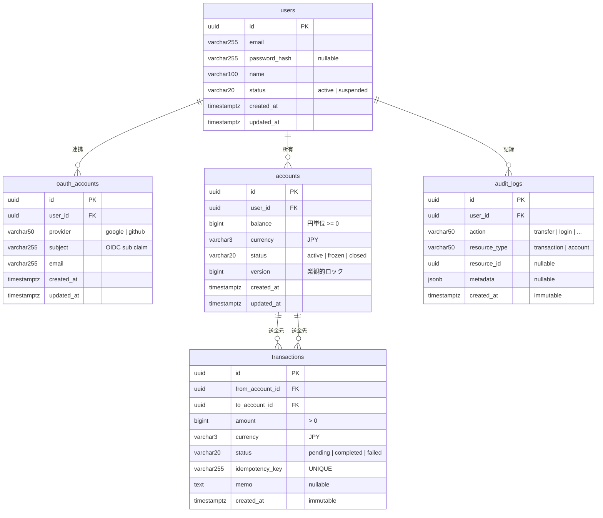

# 設計書

> Go + PostgreSQL (sqlx) + Redis + AWS ECS Fargate

---

## ユースケース一覧

### 認証

| ID    | ユースケース             | Actor            | 優先度  |
| ----- | ------------------------ | ---------------- | ------- |
| UC-01 | ユーザー登録             | 未認証ユーザー   | 🔴 必須 |
| UC-02 | ログイン / JWT発行       | 登録済みユーザー | 🔴 必須 |
| UC-11 | OIDCログイン / JWT発行   | 未認証ユーザー   | 🔴 必須 |
| UC-12 | OIDCプロバイダー連携解除 | 認証済みユーザー | 🔵 推奨 |

### 口座管理

| ID    | ユースケース | Actor            | 概要                           | 優先度  |
| ----- | ------------ | ---------------- | ------------------------------ | ------- |
| UC-03 | 口座作成     | 認証済みユーザー | JPY建て口座を作成。初期残高0円 | 🔴 必須 |
| UC-04 | 残高照会     | 認証済みユーザー | 自分の口座残高を取得           | 🔴 必須 |

### 送金

| ID    | ユースケース           | Actor            | 概要                                     | 優先度        |
| ----- | ---------------------- | ---------------- | ---------------------------------------- | ------------- |
| UC-05 | 送金実行               | 認証済みユーザー | 別ユーザーへ送金。冪等キーで二重送金防止 | 🔴 必須・コア |
| UC-06 | 取引履歴取得           | 認証済みユーザー | カーソルページネーションで一覧取得       | 🔴 必須       |
| UC-07 | 取引詳細取得           | 認証済みユーザー | 取引IDで1件を取得                        | 🔵 推奨       |
| UC-08 | 入金（Stripe Webhook） | Stripe（外部）   | Webhook受信→残高に反映                   | 🟡 任意       |

### セキュリティ

| ID    | ユースケース | 概要                           | 優先度  |
| ----- | ------------ | ------------------------------ | ------- |
| UC-09 | レート制限   | IP単位で送金APIを1分10回に制限 | 🔵 推奨 |
| UC-10 | 監査ログ記録 | 全送金操作を変更不可ログに記録 | 🔵 推奨 |

---

## ユースケース詳細 — UC-05 送金実行

最重要ユースケース。

### フロー

**① リクエスト受信・バリデーション**
Handler層でリクエストをパース。金額 > 0、送金先が自分でないこと、JWTが有効なことを検証。

```
POST /v1/transfers
Header: Idempotency-Key: {uuid-v4}
```

**② 冪等チェック（Redis）**
Idempotency-Key を Redis に SETNX（TTL=24h）。すでに存在する場合は過去の結果をそのまま返す。二重送金を完全に防ぐ。

```
Redis: SETNX idem:{key} "processing" EX 86400
```

**③ DBトランザクション開始**
PostgreSQL のトランザクションを開始。送金元・送金先口座を `SELECT FOR UPDATE` でロック取得（ロストアップデート防止）。

```sql
BEGIN;
SELECT * FROM accounts WHERE id IN (from_id, to_id) FOR UPDATE;
```

**④ ビジネスルール検証（Domain層）**
`Account.Withdraw()` でドメイン層の残高チェック。残高不足の場合は `ErrInsufficientBalance` を返しトランザクションをロールバック。

```
if account.Balance < amount → ErrInsufficientBalance
```

**⑤ 残高更新・取引レコード作成**
送金元残高を減算、送金先残高を加算。transactions テーブルにレコードを INSERT。すべて同一トランザクション内。

```sql
UPDATE accounts SET balance = balance - amount WHERE id = from_id;
UPDATE accounts SET balance = balance + amount WHERE id = to_id;
INSERT INTO transactions (...) VALUES (...);
```

**⑥ COMMIT・SQSへ通知イベント発行**
COMMIT 成功後、SQS に通知イベントを非同期送信。Notification Worker がメール送信を処理する。冪等キーの Redis 値を完了状態に更新。

```
COMMIT;
SQS.SendMessage({type: "transfer_completed", tx_id: ...})
```

> **⚠️ 分離レベルの選定**
> PostgreSQL のデフォルト分離レベルは READ COMMITTED。送金処理では `SELECT FOR UPDATE` を使うため READ COMMITTED で十分。SERIALIZABLE は不要（オーバースペック）。
> `SELECT FOR UPDATE` で行レベルロックを取るため、READ COMMITTED で整合性が保証される。

---

## ドメインモデル

### Account

```go
// domain/model/account.go
type Account struct {
    ID        uuid.UUID
    UserID    uuid.UUID
    Balance   int64      // 円単位。float禁止（誤差が出る）
    Currency  string     // "JPY"
    Status    AccountStatus
    CreatedAt time.Time
    UpdatedAt time.Time
}

func (a *Account) Withdraw(amount int64) error {
    if amount <= 0 {
        return ErrInvalidAmount
    }
    if a.Balance < amount {
        return ErrInsufficientBalance
    }
    a.Balance -= amount
    return nil
}

func (a *Account) Deposit(amount int64) error {
    if amount <= 0 {
        return ErrInvalidAmount
    }
    a.Balance += amount
    return nil
}
```

### Transaction

```go
// domain/model/transaction.go
type Transaction struct {
    ID             uuid.UUID
    FromAccountID  uuid.UUID
    ToAccountID    uuid.UUID
    Amount         int64
    Currency       string
    Status         TransactionStatus  // pending / completed / failed
    IdempotencyKey string
    CreatedAt      time.Time
}
```

### Domain Errors

```go
// domain/errors.go
var (
    ErrInsufficientBalance = errors.New("insufficient balance")
    ErrInvalidAmount       = errors.New("amount must be positive")
    ErrAccountNotFound     = errors.New("account not found")
    ErrSelfTransfer        = errors.New("cannot transfer to self")
    ErrDuplicateRequest    = errors.New("duplicate request")
)
```

### Repository Interface

```go
// domain/repository/account_repository.go
type AccountRepository interface {
    GetByIDForUpdate(ctx context.Context, tx *sqlx.Tx, id uuid.UUID) (*model.Account, error)
    Update(ctx context.Context, tx *sqlx.Tx, account *model.Account) error
    Create(ctx context.Context, account *model.Account) error
    GetByUserID(ctx context.Context, userID uuid.UUID) ([]*model.Account, error)
}
```

### Infrastructure 実装例（sqlx）

```go
// infrastructure/postgres/account_repository.go
type accountRepository struct {
    db *sqlx.DB
}

func (r *accountRepository) GetByIDForUpdate(ctx context.Context, tx *sqlx.Tx, id uuid.UUID) (*model.Account, error) {
    var account model.Account
    query := `SELECT * FROM accounts WHERE id = $1 FOR UPDATE`
    if err := tx.GetContext(ctx, &account, query, id); err != nil {
        return nil, err
    }
    return &account, nil
}

func (r *accountRepository) GetByUserID(ctx context.Context, userID uuid.UUID) ([]*model.Account, error) {
    var accounts []*model.Account
    query := `SELECT * FROM accounts WHERE user_id = $1`
    if err := r.db.SelectContext(ctx, &accounts, query, userID); err != nil {
        return nil, err
    }
    return accounts, nil
}
```

> **sqlx の主な利点**
>
> - `GetContext` / `SelectContext` で struct へ自動マッピング（手動 `rows.Scan` 不要）
> - Named Query（`:column_name`）で INSERT 時の可読性向上
> - `sqlx.Tx` は `sql.Tx` の上位互換で既存コードと混在可能

---

## DBスキーマ設計

> **設計原則**
> ① 金額はすべて `int64`（円単位）
> ② ID はすべて UUID v4
> ③ 削除はソフトデリート（`deleted_at`）
> ④ 監査カラム（`created_at` / `updated_at`）を全テーブルに付与
> ⑤ インデックスは検索頻度の高いカラムに限定

### テーブル一覧

| テーブル         | 用途                     |
| ---------------- | ------------------------ |
| `users`          | ユーザー認証情報         |
| `oauth_accounts` | OIDCプロバイダー連携情報 |
| `accounts`       | 口座・残高管理           |
| `transactions`   | 送金レコード（変更不可） |
| `audit_logs`     | 監査ログ（変更不可）     |

### ER図



### users

ユーザーの認証情報を管理するテーブル。メール/パスワード認証と OIDC 認証の両方に対応する。

| カラム          | 型           | 説明                                                                |
| --------------- | ------------ | ------------------------------------------------------------------- |
| `id`            | uuid         | ユーザーを一意に識別するID。DBが自動生成する                        |
| `email`         | varchar(255) | ログインに使うメールアドレス。重複不可                              |
| `password_hash` | varchar(255) | bcrypt でハッシュ化したパスワード。Google などで登録した場合は NULL |
| `name`          | varchar(100) | 表示名                                                              |
| `status`        | varchar(20)  | アカウントの状態。`active`（通常）/ `suspended`（停止中）           |
| `created_at`    | timestamptz  | レコード作成日時                                                    |
| `updated_at`    | timestamptz  | レコード最終更新日時                                                |

### oauth_accounts

Google などの外部プロバイダーと users を紐づけるテーブル。1ユーザーが複数のプロバイダーを連携できる。

| カラム       | 型           | 説明                                                                              |
| ------------ | ------------ | --------------------------------------------------------------------------------- |
| `id`         | uuid         | レコードを一意に識別するID                                                        |
| `user_id`    | uuid         | 紐づく users.id。外部キー                                                         |
| `provider`   | varchar(50)  | 認証プロバイダー名。`google` / `github` など                                      |
| `subject`    | varchar(255) | プロバイダー側のユーザーID（OIDC の `sub` クレーム）。provider と組み合わせて一意 |
| `email`      | varchar(255) | プロバイダーから取得したメールアドレス。参照用（ログイン判定には使わない）        |
| `created_at` | timestamptz  | 連携日時                                                                          |
| `updated_at` | timestamptz  | レコード最終更新日時                                                              |

> UNIQUE 制約: `(provider, subject)` — 同一プロバイダーの同一アカウントの二重登録を防ぐ

### accounts

ユーザーが持つ口座と残高を管理するテーブル。1ユーザーが複数口座を持てる設計。

| カラム       | 型          | 説明                                                                      |
| ------------ | ----------- | ------------------------------------------------------------------------- |
| `id`         | uuid        | 口座を一意に識別するID                                                    |
| `user_id`    | uuid        | 口座の所有者。users.id への外部キー                                       |
| `balance`    | bigint      | 残高（円単位の整数）。float は誤差が出るため使わない。負数は CHECK で禁止 |
| `currency`   | varchar(3)  | 通貨コード。現在は `JPY` のみ                                             |
| `status`     | varchar(20) | 口座の状態。`active`（通常）/ `frozen`（凍結）/ `closed`（解約済み）      |
| `version`    | bigint      | 楽観的ロック用のバージョン番号。更新のたびにインクリメント                |
| `created_at` | timestamptz | 口座作成日時                                                              |
| `updated_at` | timestamptz | 残高更新などの最終更新日時                                                |

### transactions

送金の実行記録を保管するテーブル。一度 INSERT したら UPDATE/DELETE しない不変レコード。

| カラム            | 型           | 説明                                                                            |
| ----------------- | ------------ | ------------------------------------------------------------------------------- |
| `id`              | uuid         | 取引を一意に識別するID                                                          |
| `from_account_id` | uuid         | 送金元の口座ID。accounts.id への外部キー                                        |
| `to_account_id`   | uuid         | 送金先の口座ID。accounts.id への外部キー                                        |
| `amount`          | bigint       | 送金額（円単位）。0以下は CHECK で禁止                                          |
| `currency`        | varchar(3)   | 通貨コード。現在は `JPY` のみ                                                   |
| `status`          | varchar(20)  | 取引の状態。`pending`（処理中）/ `completed`（完了）/ `failed`（失敗）          |
| `idempotency_key` | varchar(255) | クライアントが付与する重複防止キー（UUID v4）。同じキーの二重送金を防ぐ。UNIQUE |
| `memo`            | text         | 送金メモ。「夕食代」など。省略可                                                |
| `created_at`      | timestamptz  | 送金実行日時。この値は変更しない                                                |

### audit_logs

誰がいつ何をしたかを記録する監査ログ。INSERT のみで UPDATE/DELETE は行わない。

| カラム          | 型          | 説明                                                                                   |
| --------------- | ----------- | -------------------------------------------------------------------------------------- |
| `id`            | uuid        | ログエントリを一意に識別するID                                                         |
| `user_id`       | uuid        | 操作を行ったユーザー。users.id への外部キー                                            |
| `action`        | varchar(50) | 操作の種別。`transfer`（送金）/ `login`（ログイン）/ `account_created`（口座作成）など |
| `resource_type` | varchar(50) | 操作対象のリソース種別。`transaction` / `account` など                                 |
| `resource_id`   | uuid        | 操作対象のレコードID。削除されたレコードの追跡にも使えるよう uuid で保持               |
| `metadata`      | jsonb       | 追加情報を自由形式で保存。IPアドレス・ユーザーエージェントなど                         |
| `created_at`    | timestamptz | ログ記録日時。この値は変更しない                                                       |

### Read / Write 分離

```
書き込み（送金・残高更新）  ──► RDS Primary
読み取り（履歴・残高照会）  ──► RDS Read Replica
```

Connection Pooling は RDS Proxy を介することで、ECS タスクが増加しても `max_connections` を枯渇させない。

### パーティショニング設計（将来対応）

取引履歴は時間とともに膨大になるため、`created_at` による範囲パーティショニングを想定する。

```sql
-- 月次パーティショニング（将来実装）
CREATE TABLE transactions (
    ...
) PARTITION BY RANGE (created_at);

CREATE TABLE transactions_2025_06
    PARTITION OF transactions
    FOR VALUES FROM ('2025-06-01') TO ('2025-07-01');

CREATE TABLE transactions_2025_07
    PARTITION OF transactions
    FOR VALUES FROM ('2025-07-01') TO ('2025-08-01');
```

> 現時点では単一テーブル + インデックスで十分。月間100万件を超えたタイミングでパーティショニングを検討する。

### マイグレーション SQL

```sql
-- 000001_create_users.up.sql
CREATE TABLE users (
    id            uuid         PRIMARY KEY DEFAULT gen_random_uuid(),
    email         varchar(255) UNIQUE NOT NULL,
    password_hash varchar(255) NOT NULL,
    name          varchar(100) NOT NULL,
    status        varchar(20)  NOT NULL DEFAULT 'active',
    created_at    timestamptz  NOT NULL DEFAULT NOW(),
    updated_at    timestamptz  NOT NULL DEFAULT NOW()
);

-- 000002_create_accounts.up.sql
CREATE TABLE accounts (
    id         uuid    PRIMARY KEY DEFAULT gen_random_uuid(),
    user_id    uuid    NOT NULL REFERENCES users(id),
    balance    bigint  NOT NULL DEFAULT 0 CHECK(balance >= 0),
    currency   varchar(3)  NOT NULL DEFAULT 'JPY',
    status     varchar(20) NOT NULL DEFAULT 'active',
    version    bigint  NOT NULL DEFAULT 0,
    created_at timestamptz NOT NULL DEFAULT NOW(),
    updated_at timestamptz NOT NULL DEFAULT NOW()
);
CREATE INDEX idx_accounts_user_id ON accounts(user_id);

-- 000003_create_transactions.up.sql
CREATE TABLE transactions (
    id               uuid         PRIMARY KEY DEFAULT gen_random_uuid(),
    from_account_id  uuid         NOT NULL REFERENCES accounts(id),
    to_account_id    uuid         NOT NULL REFERENCES accounts(id),
    amount           bigint       NOT NULL CHECK(amount > 0),
    currency         varchar(3)   NOT NULL DEFAULT 'JPY',
    status           varchar(20)  NOT NULL DEFAULT 'pending',
    idempotency_key  varchar(255) UNIQUE NOT NULL,
    memo             text,
    created_at       timestamptz  NOT NULL DEFAULT NOW()
);
CREATE INDEX idx_tx_from_account ON transactions(from_account_id);
CREATE INDEX idx_tx_to_account   ON transactions(to_account_id);
CREATE INDEX idx_tx_created_at   ON transactions(created_at DESC);
-- カーソルページネーション用

-- 000004_create_audit_logs.up.sql
CREATE TABLE audit_logs (
    id            uuid        PRIMARY KEY DEFAULT gen_random_uuid(),
    user_id       uuid        NOT NULL REFERENCES users(id),
    action        varchar(50) NOT NULL,
    resource_type varchar(50) NOT NULL,
    resource_id   uuid,
    metadata      jsonb,
    created_at    timestamptz NOT NULL DEFAULT NOW()
);
CREATE INDEX idx_audit_user_id ON audit_logs(user_id);
```

---

## APIエンドポイント設計

| Method | Path                      | 説明                                 | Auth                  |
| ------ | ------------------------- | ------------------------------------ | --------------------- |
| `POST` | `/v1/auth/register`       | ユーザー登録                         | 不要                  |
| `POST` | `/v1/auth/login`          | ログイン・JWT発行                    | 不要                  |
| `GET`  | `/v1/auth/oidc/authorize` | OIDCプロバイダーへリダイレクト       | 不要                  |
| `GET`  | `/v1/auth/oidc/callback`  | コールバック受信・JWT発行            | 不要                  |
| `POST` | `/v1/accounts`            | 口座作成                             | JWT                   |
| `GET`  | `/v1/accounts`            | 自分の口座一覧                       | JWT                   |
| `GET`  | `/v1/accounts/:id`        | 口座詳細・残高                       | JWT                   |
| `POST` | `/v1/transfers`           | **送金実行**（コア）                 | JWT + Idempotency-Key |
| `GET`  | `/v1/transfers`           | 取引履歴（カーソルページネーション） | JWT                   |
| `GET`  | `/v1/transfers/:id`       | 取引詳細                             | JWT                   |
| `POST` | `/v1/webhooks/stripe`     | Stripe Webhook受信                   | Stripe署名検証        |
| `GET`  | `/health`                 | ヘルスチェック                       | 不要                  |

### 送金リクエスト / レスポンス

```json
// Request
// Header: Idempotency-Key: uuid-v4
{
  "from_account_id": "uuid",
  "to_account_id":   "uuid",
  "amount":          5000,
  "currency":        "JPY",
  "memo":            "夕食代"
}

// Response 201 Created
{
  "id":              "tx-uuid",
  "status":          "completed",
  "amount":          5000,
  "from_account_id": "...",
  "to_account_id":   "...",
  "created_at":      "2025-06-18T14:32:00Z"
}

// Error 400
{
  "code":    "INSUFFICIENT_BALANCE",
  "message": "残高が不足しています"
}
```

---

## セキュリティ設計

| 脅威                | 対策                                            | 実装箇所                 |
| ------------------- | ----------------------------------------------- | ------------------------ |
| 二重送金            | Redis で冪等キー管理（SETNX + TTL）             | TransferUsecase          |
| 残高競合            | SELECT FOR UPDATE（行ロック）                   | PostgreSQL / accountRepo |
| 不正ログイン        | bcrypt ハッシュ化・JWT 有効期限15分             | AuthUsecase              |
| OIDC CSRF           | state パラメーター（UUID）を Redis に保存・検証 | OIDCCallbackHandler      |
| OIDCトークン改ざん  | nonce をセッションに埋め込み id_token で検証    | OIDCCallbackHandler      |
| DoS 攻撃            | IP単位レート制限（Redis sliding window）        | RateLimitMiddleware      |
| SQLインジェクション | プレースホルダ使用（sqlx）                      | infrastructure/postgres  |
| シークレット漏洩    | Secrets Manager・Git に秘匿情報をコミットしない | インフラ設計             |
| MITM                | HTTPS強制（ALB + ACM）                          | インフラ                 |

---

## CAP定理・整合性モデル

PostgreSQL・Redis ともに **CP系**（Consistency + Partition Tolerance）を選択している。

| システム   | CAP分類 | 理由                                                                       |
| ---------- | ------- | -------------------------------------------------------------------------- |
| PostgreSQL | CP      | トランザクション整合性を最優先。ネットワーク分断時は可用性より整合性を選ぶ |
| Redis      | CP      | 冪等キーの整合性が崩れると二重送金が発生するため可用性より整合性を優先     |
| SQS        | AP      | 通知は多少遅延しても問題ない。メッセージの順序より可用性を優先             |

**金融システムでは整合性 > 可用性**。残高が合わないことは許容できないが、一時的にサービスが重くなることは許容できる。

---

## 通知ファンアウト設計（SNS + SQS）

SQS 単体は Point-to-Point（1対1）のため、通知チャンネルが増えるたびに送金ロジックの変更が必要になる。
SNS を間に挟むことで、送金ロジックはSNSにパブリッシュするだけでよくなる。

```
Transfer Service
      │ パブリッシュ
      ▼
   AWS SNS（通知トピック）
   ├──► SQS（メール用）  ──► Notification Worker ──► SES
   └──► SQS（Push通知用）──► Notification Worker ──► Push通知
```

新しい通知チャンネル（Slack など）を追加するときも、SNS に SQS をサブスクライブするだけで送金ロジックへの変更ゼロ。

---

## 設計ノート

### 金額は int64

float は `0.1 + 0.2 = 0.30000000000000004` のような浮動小数点誤差が発生する。金融では1円の誤差も許容できないため、最小単位（円）で `int64` 整数管理する。PostgreSQL では `bigint` にマッピング。

### 冪等性

クライアントが UUID v4 の `Idempotency-Key` を Header に付けて送信する。サーバー側で Redis に SETNX（TTL=24h）し、同じキーが来た場合は処理をスキップして過去の結果を返す。ネットワーク再送・二重タップによる二重送金を防ぐ。

### 分離レベル：READ COMMITTED

`SELECT FOR UPDATE` で行レベルロックを取得するため READ COMMITTED で残高の整合性が保証される。SERIALIZABLE はデッドロックリスクが上がりスループットが低下するためオーバースペック。

### Clean Architecture

ドメイン層（ビジネスルール）を DB やフレームワークから分離することで、DB を差し替えてもビジネスロジックが壊れない。Repository を interface にすることで usecase 層のユニットテストが DB なしで書ける。

### デッドロック防止

`SELECT FOR UPDATE` で複数行をロックする場合、常に UUID 昇順でロックを取得する。`from_account_id` と `to_account_id` をソートしてからロックすることで逆順ロックによるデッドロックを防ぐ。

### CAP 定理：CP 系を選択

PostgreSQL・Redis ともに CP 系（整合性 + 分断耐性）を選択した。金融では残高の不整合は許容できないため、ネットワーク分断時は可用性より整合性を優先する。通知（SQS）は多少遅延しても問題ないため AP 系。

### Read / Write 分離

RDS Read Replica を用意し、参照系クエリ（取引履歴・残高照会）を Replica に向ける。書き込み（送金・残高更新）は Primary のみに流す。RDS Proxy を介して Connection Pooling を行い、ECS タスクのスケールアウト時に `max_connections` を枯渇させない。

### 高負荷時の同時送金

`SELECT FOR UPDATE` の行ロックにより同一口座への同時送金は直列化される。RDS Proxy の Connection Pooling で DB 接続数を制御する。k6 による負荷試験で同時100件送金でも残高整合性が壊れないことを確認する。

### 監査ログのスケール

現状は PostgreSQL の `audit_logs` テーブルに INSERT のみで管理する。月間イベント数が膨大になった場合は S3 + Athena への移行を想定している。S3 は大量データに強く、Athena でアドホッククエリが可能。

### 分散ロック vs DBトランザクション

UC-05の送金はサーバー内で数百ms以内に完結するため `SELECT FOR UPDATE` で十分。長時間フロー（ユーザー操作を挟む複数ステップ）にDBトランザクションを使うとロックが保持されたまま離脱・クラッシュが起き得るため、Redisの分散ロックを使う。

| ケース                       | 手段                  | 理由                                       |
| ---------------------------- | --------------------- | ------------------------------------------ |
| 送金（現在）                 | SELECT FOR UPDATE     | 数百ms以内で完結するDBトランザクション     |
| 冪等性管理（現在）           | Redis SETNX TTL=24h   | 重複リクエスト防止（送金ロックとは別用途） |
| 複数ステップ予約（将来対応） | Redis SET NX EX {TTL} | ユーザー離脱・クラッシュ時に自動解除       |

将来「送金予約（funds hold）→ 後で確定」のようなフローを追加する場合は以下のパターンを使う。

```
SET lock:transfer:{account_id} {user_id} NX EX 300
```

- `NX`: 他ユーザーがロック中の場合は取得失敗
- `EX 300`: 5分で自動解除（ユーザー離脱・タイムアウト対応）
- 確定時のDB更新は短時間トランザクションで行う

> 現状の Redis SETNX は冪等キー（`idem:{key}`）専用。分散ロック（`lock:{resource}`）とキー名前空間を分けて管理する。

### OpenID Connect（OIDC）認証フロー

メール/パスワード認証と並行してOIDCをサポートする。認証後は内部JWTを発行するため、既存の認可ミドルウェアは変更不要。

```
① GET /v1/auth/oidc/authorize?provider=google
   └─ state（UUID）と nonce を生成し Redis に保存（TTL=10分）
   └─ プロバイダーの Authorization Endpoint へリダイレクト

② GET /v1/auth/oidc/callback?code=...&state=...
   └─ Redis で state を検証（CSRF防止）
   └─ Authorization Code を Token Endpoint へ送信し id_token を取得
   └─ id_token の nonce / aud / iss を検証
   └─ sub クレームで oauth_accounts を検索
      ├─ 既存レコードあり → 対応する users.id で JWT 発行
      └─ 未登録 → users + oauth_accounts を同一トランザクションで INSERT → JWT 発行
```

`users.password_hash` は OIDC専用ユーザーの場合 NULL。`oauth_accounts` テーブルで `(provider, subject)` の UNIQUE 制約により同一プロバイダーアカウントの二重登録を防ぐ。
